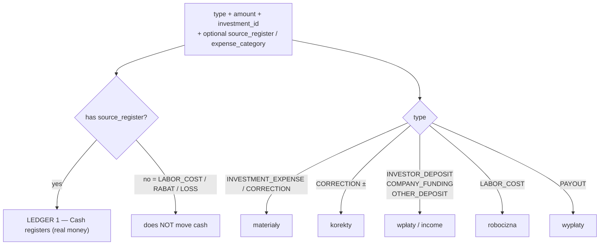

# Investment financials: how marża / materiały / robocizna / korekty connect

> Source of truth for the numbers: `src/lib/db/investment-financials.ts` (`deriveFinancials`),
> `src/lib/db/calculate-margin.ts`, `src/lib/db/calculate-balance.ts`,
> `src/components/investments/financial-stats.tsx`.

## TL;DR — the one thing that's non-obvious

There are **two independent ledgers** sitting on the same `transactions` table, and they
barely talk to each other:

1. **Cash ledger (kasy / transfers)** — real money in/out of registers. Every row here has a
   `source_register`. This is "the transfer system".
2. **Investment P&L** — derived numbers shown on the investment page: **Bilans inwestora**
   (the client's account) and **Marża** (company profit, admin-only).

**`robocizna` (LABOR_COST) lives ONLY in ledger 2.** It has _no source register_ — it's not
a cash movement, it's a billing/markup figure (what the company charges the investor for
labour). It never moves a złoty between registers; it only feeds the P&L.

The base model: **`marża` starts from robocizna alone, `bilans` from wpłaty minus costs.**
Four modifier types (`korekta`, `rabat`, `strata`, `settled` material) bend those two
formulas — see the table below.

---

## The transaction types and where each one lands

- `materiały` = `Σ INVESTMENT_EXPENSE + Σ CORRECTION`, **excluding rows flagged `settled`**
  (`investment-financials.ts:41`). Corrections fold into the material total.
- `korekty` is the **same CORRECTION rows** surfaced as their own line. A CORRECTION can be
  negative (invoice credit).
- `robocizna` = `Σ LABOR_COST`; `wypłaty` = `Σ PAYOUT`.

---

## The two displayed numbers (current formulas)

`deriveFinancials` (`investment-financials.ts:34`) is the single funnel — every `total_*`
aggregate flows from there into the two formulas:

- **Bilans inwestora** (`calculate-balance.ts:6-8`):
  `wpłaty − (materiały + robocizna) + rabat` — client-facing balance.
- **Marża** (`calculate-margin.ts:13-14`):
  `robocizna − wypłaty − rabat − strata − settled`. **Plain materiały are absent on purpose**
  (see below).

### Why plain materiały are absent from marża

> Materials are a **pass-through cost billed to the client**. The client funds them via
> deposits, so they cancel out and never become the company's cost. Profit comes only from
> the labour markup.

That holds for "materiały osobno, robocizna osobno" jobs. The `settled` flag (R+M jobs) is
the exception — material the company eats, so it _does_ hit marża.

---

## The four modifiers — how each bends the two formulas

| Type / flag               | source_register | marża | bilans | Notes                                                                                                                                                                                                                   |
| ------------------------- | --------------- | ----- | ------ | ----------------------------------------------------------------------------------------------------------------------------------------------------------------------------------------------------------------------- |
| `CORRECTION` (korekta)    | optional        | —     | ↓/↑    | Folds into materiały; may be negative. Moves only the balance.                                                                                                                                                          |
| `RABAT` (rabat)           | **none**        | ↓     | ↑      | Labour discount: company earns less, client owes less. Positive amount. Requires investment.                                                                                                                            |
| `LOSS` (strata)           | **none**        | ↓     | —      | Company-absorbed cost. Positive amount, investment **optional** (unattached losses hit only the global marża on Raporty). Never touches bilans (a test pins this).                                                      |
| `settled` flag on expense | required        | ↓     | —      | "Wliczone w robociznę": R+M material the company buys but already priced into robocizna. Leaves a register, lowers marża, off the client bill. Valid on `INVESTMENT_EXPENSE` and `CORRECTION` (`transfers.ts:227-239`). |

`RABAT` and `LOSS` are positive-amount types with **no source register** (billing figures,
not cash movements). `settled` is a boolean on an otherwise normal material expense, so it
keeps `source_register` required.

`settled` is a **flag, not a dedicated type**: type is orthogonal to expense category, so a
type approach would need one type _per category_ (`INTERNAL_BUILDING_MATERIAL`,
`INTERNAL_FINISHING_MATERIAL`, …), multiplying every time a category is added — disqualifying.
A boolean stays orthogonal to the category axis.

Display: `RABAT` is the green "Rabat" line, `LOSS` the purple "Strata" stat, and settled
material its own block in `financial-stats.tsx`. `LOSS` is deliberately kept out of
`buildFinancialFields` so it never enters the bilans toggle sum or the client-facing export.

Specs: `context/reference/superpowers/archive/2026-06-11-investment-rabat.md`,
`context/reference/superpowers/archive/2026-06-11-loss-strata-transfer-type.md`,
`context/reference/superpowers/archive/2026-06-12-settled-internal-material-design.md`.
