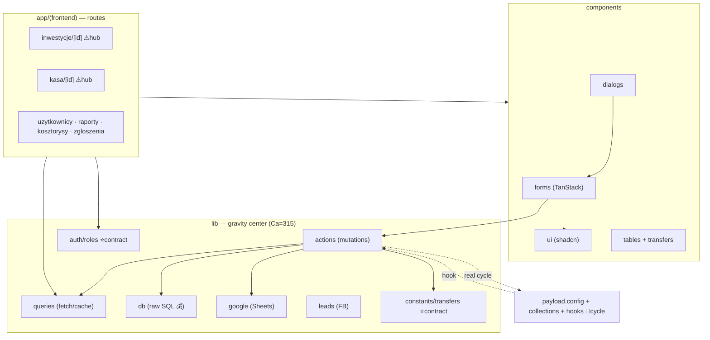

# Repo Map — onboarding guide

> Synthesis of two Wide-Scan artifacts, **not** a re-derivation. Reads them together:
> [`artifact-1-territory.md`](artifact-1-territory.md) (git activity) ·
> [`artifact-2-structure.md`](artifact-2-structure.md) (dependency graph).
> (The M4L2 contributors artifact was dropped — this is a solo repo, so it collapses; see §5.)
> Window: full repo history, 2026-02-11 → 2026-07-08 (975 commits, ~5 months old).
> Goal: after 15 minutes here you know where things live, what's dangerous, and where to start.

## 1. TL;DR

Wykonczymy is a **Next.js + Payload CMS business dashboard** for a finishing/renovation
company — cash registers, transfers, investments, employees, plus a Google-Sheets
"kosztorys" (cost estimate) integration and a Facebook Lead Ads pipeline. Polish UI,
English code. It is a **solo project** (one human, Konrad; 72% of commits pair-authored
with Claude agents), so `AGENTS.md` + `context/` are the only second source of truth —
treat them as load-bearing, not decoration. The system's center of gravity is the
**transfer/finance engine**: it is simultaneously the most-depended-on code (artifact-2)
and the most-churned (artifact-1). Danger concentrates in three places — the money SQL
(`sum-transfers.ts`, which recently turned unstable), the auth contracts (`roles.ts`, Ca=44),
and the two composition-hub route pages that touch everything. (The one "real" import cycle
depcruise reports is already author-mitigated and runtime-safe — noise, not debt; see §4.)

## 2. Terrain — big vs peripheral, deep vs shallow

**Deep, load-bearing (high responsibility):**

- `lib/` is the gravitational center — `Ca=315`, almost everything depends on it
  (artifact-2). Inside it the instability gradient is textbook-correct: contracts stable
  (`constants` I=0%, `auth` I=5%), composers unstable (`actions` I=54%, `queries` I=63%).
- `components/forms` (435 commits) + `components/ui` (409) are the most-touched surfaces —
  the app is form-heavy, built on TanStack Form via `useAppForm()`.

**Composition hubs (edit-blast-radius, not dependency-blast):**

- `app/(frontend)/inwestycje/[id]/page.tsx` (63 commits, 52 areas) and
  `kasa/[id]/page.tsx` (43 commits, 51 areas) assemble most of the app. Distinct from
  artifact-2's dependency leaves (`lib/utils/cn.ts` Ca=99) — those are _depended-on_; these are
  where _edits land_.

**Peripheral / shallow:** `access/` (nearly empty in the graph — RBAC likely inline in
collections), `scripts/`, `seed.ts`, framework orphans (`icon.tsx`, `template.tsx`).

**Activity over time** (artifact-1): Feb–Mar build-out (forms/routes) → May Google-Sheets
pivot → **July = leads pipeline + UI refresh**. The hot area moves; weight recency.

## 3. Real coupling — what actually changes together

Cross-referencing git co-change (artifact-1) with the import graph (artifact-2):

| Coupling                                              | Source         | Kind                                                                     |
| ----------------------------------------------------- | -------------- | ------------------------------------------------------------------------ |
| `__tests__` ↔ `lib/actions` (75) / `lib/queries` (52) | git            | **Real** — tests guard the data/mutation layer; move together            |
| `components/forms` ↔ `lib/actions` (44)               | git + graph    | **Real** — a form + its server action ship as a unit                     |
| `components/dialogs` ↔ `components/forms` (39)        | git + graph    | **Real** — dialogs wrap forms; near-inseparable                          |
| `lib/actions` ↔ `lib/queries` (40)                    | git + graph    | **Real** — mutate-then-invalidate/read                                   |
| the Payload hook cycle                                | **graph only** | Reported by graph, but **runtime-safe** (lazy edge) — not live debt (§4) |
| the 15 `useAppForm` form cycles                       | **graph only** | By-design mutual refs; low risk                                          |
| `migrations/index.ts` spanning 47 areas               | git only       | **Regeneration** — cheap/mechanical, _not_ a design signal               |

The **action ↔ query ↔ form ↔ dialog cluster** is the app's true working unit — a feature
change rarely stays inside one of them. Where sources disagree: git can't see the Payload
hook cycle (runtime/config coupling), and the graph can't see that `migrations/index.ts`
churn is just re-exports. `access/` coupling is **`unknown`** — the graph barely covers it.

## 4. Risk zones

| Zone                                                  | Why                                                                                                                                                                                                                                                                                                                    | Evidence                           |
| ----------------------------------------------------- | ---------------------------------------------------------------------------------------------------------------------------------------------------------------------------------------------------------------------------------------------------------------------------------------------------------------------- | ---------------------------------- |
| **Transfer/finance core**                             | Most-depended-on _and_ most-churned; `constants/transfers.ts` is a 29-dependent contract, `actions/transfers.ts` the #1 churned file. AGENTS.md warns the transfer-type union goes stale.                                                                                                                              | artifact-1 + artifact-2 agree      |
| **Money SQL** (`lib/db/sum-transfers.ts`)             | Raw `@vercel/postgres` financial calc; graph can't verify correctness — needs test coverage.                                                                                                                                                                                                                           | artifact-2 `unknown`               |
| **Payload hook cycle** (already mitigated)            | `config → collections/transfers → sync-sheet → sheets-sync → … → config`. **Not live debt** — the hook→action edge is a lazy `await import()` (commented in `sync-sheet.ts`), so the init chain never closes; depcruise flags it only because it follows dynamic imports. No code fix; tooling decision only (EX-411). | artifact-2 + code read             |
| **Auth contracts** (`auth/roles.ts` Ca=44)            | Wide blast radius on the access plane; `access/` logic is graph-invisible so real reach is under-measured.                                                                                                                                                                                                             | artifact-2                         |
| **Composition hubs** (`inwestycje/[id]`, `kasa/[id]`) | Touch almost anything and one moves; hardest pages to change safely.                                                                                                                                                                                                                                                   | artifact-1 (52/51 areas)           |
| **Money SQL got fragile** ⚠                           | `lib/db/sum-transfers.ts` flipped stable→unstable since the prior cruise (Ca 11→5, I 15%→50%) — it grew outgoing deps. A money-path module becoming a composer raises change-sensitivity; pair with test coverage (still `unknown`).                                                                                   | artifact-2 (re-cruised 2026-07-08) |

## 5. Who to ask

Solo repo — one human (Konrad) for every area, so a contributor map doesn't apply. Bus-factor
is 1, which is exactly why the durable docs (`AGENTS.md`, `context/`) are load-bearing: they're
the only second source of truth. Substitute for "asking an expert": read the area's `context/`
doc + `AGENTS.md` section and pair with an agent — how ~72% of the code was written.

## 6. First day — read these, in order

1. **`AGENTS.md`** — the rulebook; non-inferable conventions (mutation pattern, cache
   `updateTag` vs `revalidateTag`, env layer, migrations-by-hand).
2. **`src/collections/transfers.ts`** — the transfer-type union; the domain's spine (AGENTS.md
   says read it here, don't trust copies).
3. **`src/lib/actions/transfers.ts`** — #1 churned file; the mutation pattern in the flesh.
4. **`src/lib/db/sum-transfers.ts`** — how the money is actually computed (raw SQL).
5. **`src/app/(frontend)/inwestycje/[id]/page.tsx`** — the biggest composition hub; shows how
   a page wires queries + components together.
6. **`src/components/forms/` + `useAppForm()`** — the form spine every feature touches.
7. **`context/foundation/investment-financials-and-discount.md`** — how marża / materiały /
   robocizna / korekty connect (the finance model the UI reflects).
8. **`context/map/artifact-2-structure.md`** — the dependency detail behind §3–4
   (re-cruised 2026-07-08; paths current).

## 7. What's next — follow-ups from this mapping

Ordered by cost/value. None block a branch switch; captured here so they survive one.

1. ~~**Re-cruise `artifact-2` to clear the stale path.**~~ **DONE 2026-07-08.** Re-cruised
   after the `lib/tables/* → components/tables/*` move; refreshed metrics, orphans, and the
   real-cycle path in `artifact-2-structure.md`. Findings: the cycle re-routed through the
   auth chain (7 nodes, no longer via the now-deleted `actions/utils.ts`); `sum-transfers.ts`
   flipped stable→unstable; `parse-date-range.ts` is a false orphan (test-only, keep).

2. **Wire depcruise into CI/pre-push as a guard.** The config already encodes AGENTS.md
   invariants as `error`-severity rules (`no-hook-imports-revalidate`,
   `no-payload-graph-imports-env-server`). Add a `depcruise` script to `package.json` and
   call it from `.husky/pre-push` so a boundary violation fails locally instead of drifting.
   Turns the map from a snapshot into a living check.

3. **Decide how pre-push treats `no-circular` (EX-411).** Originally scoped as an "M4L3 Deep
   Focus refactor" on the Payload cycle — but a code read showed both real cycles (Payload +
   `constants/transfer-rules ↔ transfers`) are already author-mitigated and runtime-safe (lazy
   `await import()` / call-time access, both commented). So there is **no code to fix**;
   `no-circular` is noise-only here. The real decision is tooling: keep it at `warn` (never
   block the push), optionally baseline the 2 known cycles. Folds into #2.

4. **Close the two `unknown` coverage gaps the graph can't see.** (a) Money SQL
   (`lib/db/sum-transfers.ts`) correctness — needs a test-coverage review, not a graph.
   (b) `access/` RBAC is nearly graph-invisible; confirm `src/access/*` consumes
   `auth/roles.ts` consistently by reading, not cruising. Anchor any new tests on
   `context/foundation/test-plan.md` risks (create it via `/10x-test-plan` if still absent).

5. **Dead-code check on the two orphans** artifact-2 flagged: `lib/parse-date-range.ts` and
   `lib/tables/column-meta.ts` (module augmentation — gate deletion on `tsc`, not grep).

6. **Refresh cadence.** This map is one snapshot of a fast-moving repo. Re-run the full M4L2
   flow (or at least the depcruise + git-territory steps) after any large structural change
   — a folder move, a new top-level feature, or when the risk zones stop matching reality.

> Per AGENTS.md, actionable refactor items (1–5) belong in Linear ("Wykonczymy v2") rather
> than lingering as a doc TODO. This section is the hand-off note; promote each to a Linear
> issue when you pick it up.

## 8. Limitations

- **Window & method:** full history but only ~5 months; "12 months" = the repo's whole life.
  This is an _activity + structure_ map, not a semantic one.
- **Churn ≠ importance ≠ risk** — a file edited 71× may be volatile-by-design or a pain point;
  git can't distinguish. Always pair artifact-1 counts with artifact-2 stability.
- **What the map does NOT tell you:** runtime coupling (Payload hook registration,
  `getPayload({config})` dynamic resolution, cache-tag wiring), SQL correctness, the
  Sheets/Payload-admin planes (under-represented in file churn), and `access/` RBAC (nearly
  graph-invisible). These are `unknown`, not "no coupling."
- **Generated vs hand-edited coupling** is separated where known (`migrations/index.ts`,
  `payload-types.ts`) — regeneration churn is cheap and must not be read as design pressure.
- **One snapshot in a moving repo** — `lib/tables` moved _during_ this mapping session; expect
  further drift and re-cruise `artifact-2` when the structure feels off.
