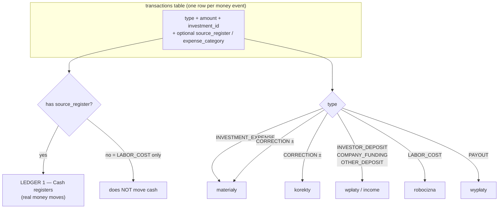
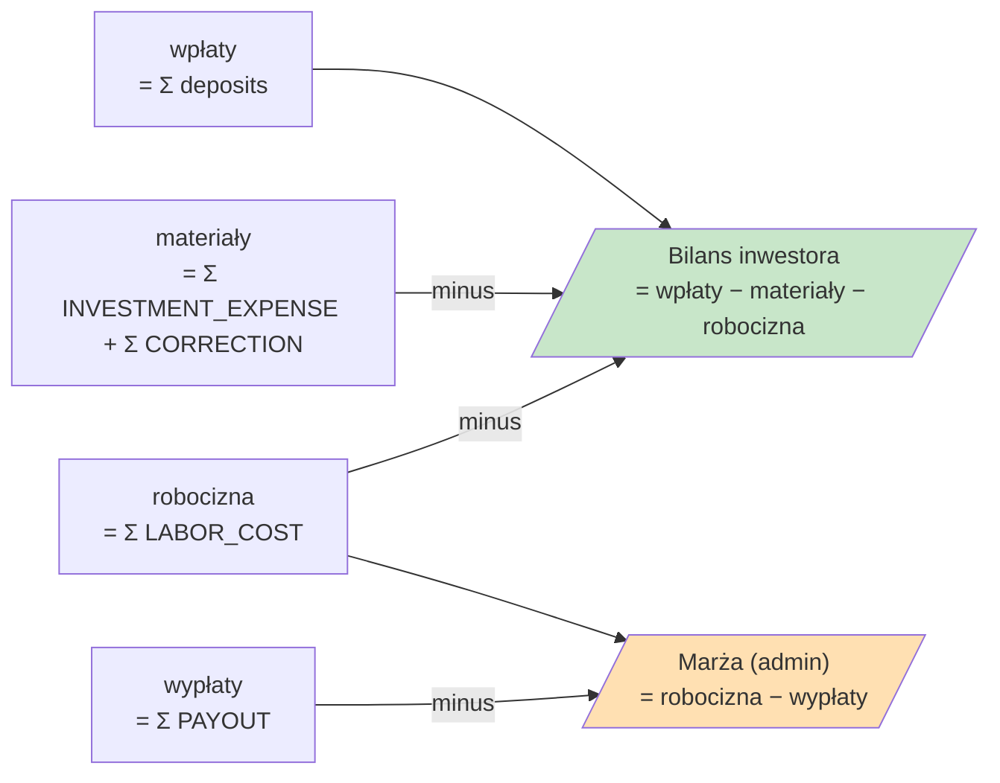
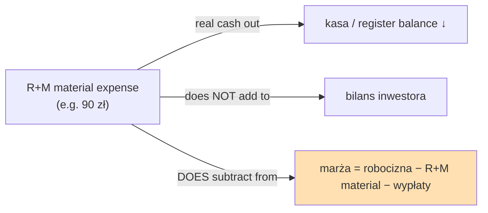
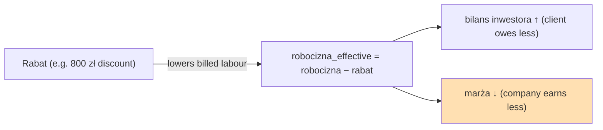

# Investment financials: how marża / materiały / robocizna / korekty connect

> Source of truth for the numbers: `src/lib/db/sum-transfers.ts` (`deriveFinancials`),
> `src/lib/calculate-margin.ts`, `src/lib/calculate-balance.ts`,
> `src/components/investments/financial-stats.tsx`.
> Client request transcript: `docs/notes`.

## TL;DR — the one thing that's non-obvious

There are **two independent ledgers** sitting on the same `transactions` table, and they
barely talk to each other:

1. **Cash ledger (kasy / transfers)** — real money in/out of registers. Every row here has a
   `source_register`. This is "the transfer system".
2. **Investment P&L** — derived numbers shown on the investment page. It has two sub-views:
   - **Bilans inwestora** (what the client's account looks like)
   - **Marża** (company profit, admin-only)

**`robocizna` (LABOR_COST) is the row that lives ONLY in ledger 2 and never in ledger 1.**
It has _no source register_ — it is not a cash movement, it's a billing/markup figure
(what the company charges the investor for labour). That is exactly why it feels "outside
the system": it never moves a single złoty between registers, it only feeds the P&L.

The second non-obvious thing: **`marża` is built from robocizna alone.** Material costs do
**not** touch it. That is the root of both client requests below.

---

## The transaction types and where each one lands



Notes:

- `materiały` = `SUM(INVESTMENT_EXPENSE) + SUM(CORRECTION)` — corrections are folded into the
  material total. `sum-transfers.ts:266-267`.
- `korekty` is the **same CORRECTION rows** surfaced as their own line. A CORRECTION can be
  negative (invoice credit). `sum-transfers.ts:268`.
- `robocizna` = `SUM(LABOR_COST)`. `sum-transfers.ts:273`.
- `wypłaty` = `SUM(PAYOUT)`. `sum-transfers.ts:274`.

---

## How the two displayed numbers are computed



- **Bilans inwestora** (`calculate-balance.ts:5-8`):
  `wpłaty − (materiały + robocizna)`. This is the client-facing balance.
- **Marża** (`calculate-margin.ts:5-6`):
  `robocizna − wypłaty`. **Materiały are absent on purpose.**

### Why materiały are absent from marża

The implicit business assumption baked into the current model:

> Materials are a **pass-through cost billed to the client**. The client funds them via
> deposits, so they cancel out and never become the company's cost. Profit comes only from
> the labour markup. Hence `marża = robocizna − wypłaty`.

That assumption holds for "materiały osobno, robocizna osobno" jobs. It **breaks** for the
R+M jobs described below.

---

## Where the client's two requests break the model

### Request A — "Materiał jako składowa robocizny" (R+M jobs)

Quote (paraphrased from `docs/notes`): on R+M jobs the client is charged a single
labour-with-material price. The 90 zł of material the company actually buys is now **the
company's own cost**, so it must reduce marża — but today it doesn't, because marża ignores
materials. Logging it as a normal `INVESTMENT_EXPENSE` is wrong because that **bills the
client extra** (raises what they owe via the balance).

What the client converged on. The new "R+M material" line must:

| Requirement                           | Current INVESTMENT_EXPENSE | Current LABOR_COST    | New R+M material needs     |
| ------------------------------------- | -------------------------- | --------------------- | -------------------------- |
| Leaves a cash register (real spend)   | ✅ yes                     | ❌ no                 | ✅ **yes**                 |
| Counts against client's bill (bilans) | ✅ yes                     | ✅ yes                | ❌ **no**                  |
| Reduces marża                         | ❌ no                      | — (it _is_ the +side) | ✅ **yes**                 |
| Shown under investment costs          | ✅ yes                     | ✅ yes                | ✅ yes (next to robocizna) |

His final formula: **`marża = robocizna − (te materiały)`**.



### Request B — "Rabat" (discount off robocizna)

Quote: a `korekta` only moves `saldo`, not marża. A **rabat is a discount on the labour
price** — it is the company's cost, so it must reduce marża; and because the client is billed
less, it also reduces what the client owes.

Economically a rabat is just a **negative adjustment to robocizna**:



So rabat hits **both** numbers, where korekta hits only the balance. That dual effect is the
whole reason the client says "korekta nie wystarczy".

---

## Current state in code

- **No `RABAT` type exists.** Transfer types are in `src/lib/constants/transfers.ts` /
  `src/collections/transfers.ts`. There is `CORRECTION` only.
- **No R+M / "niepodlegające rozliczeniu" material type exists.**
- `marża` and `bilans` are hardcoded formulas (`calculate-margin.ts`,
  `calculate-balance.ts`) — they have no concept of either new line.
- `deriveFinancials` (`sum-transfers.ts:260-276`) is the single funnel: add a new type's
  aggregate here and it flows everywhere.

---

## What we need to do to make it happen

Both requests reduce to the same shape: **make `marża` able to subtract a new kind of cost**,
and **decide whether that cost also touches the investor balance and the cash registers.**

### A) R+M material — proposed type `MATERIAL_INTERNAL` (working name)

1. **New transfer type** in `constants/transfers.ts` + `collections/transfers.ts`.
   - `source_register`: **required** (it's a real spend, must drop register balance — same as
     INVESTMENT_EXPENSE).
   - `expense_category`: optional.
2. **`deriveFinancials`** — add `totalInternalMaterials = Σ MATERIAL_INTERNAL`.
3. **`calculate-margin.ts`** — `marża = robocizna − wypłaty − internalMaterials`.
4. **`calculate-balance.ts`** — **exclude** it (must NOT raise what the client owes). This is
   the key difference vs INVESTMENT_EXPENSE.
5. **Display** — a row next to robocizna (orange family) in `financial-stats.tsx`.
6. **Sheets sync** — decide if it belongs in the materiały tab (probably not, since it's not
   billed to the client).

### B) Rabat — proposed type `RABAT`

1. **New transfer type**, amount is a positive discount value.
2. **`deriveFinancials`** — add `totalRabat = Σ RABAT`.
3. **`calculate-margin.ts`** — `marża = robocizna − wypłaty − rabat`.
4. **`calculate-balance.ts`** — subtract rabat from billed labour so the client owes less
   (i.e. treat robocizna as `robocizna − rabat`).
5. **No cash movement** — like LABOR_COST, a rabat is a billing adjustment, so **no source
   register** (it never leaves a kasa). Confirm with client.
6. **Validation** — sign rule (mirror the CORRECTION-must-be-negative rule in
   `validation-utils.ts`).

### Open decisions (need the client)

1. **Does rabat reduce the investor balance (saldo)?** The transcript implies yes (client
   billed less). Confirm.
2. **R+M material: is it ever billed at all, or always fully absorbed by the company?** The
   model above assumes fully absorbed (zero client bill, full margin hit).
3. **Naming in Polish UI** — "Materiały R+M" / "Materiały niepodlegające rozliczeniu" for A;
   "Rabat" for B.
4. **Where rabat/R+M sit in the Sheets export**, if anywhere.

### Migration / blast radius

Touch points for either type (single funnel keeps it small):

- `src/lib/constants/transfers.ts`, `src/collections/transfers.ts` (type + field rules)
- `src/lib/db/sum-transfers.ts` (`deriveFinancials`, and the `total_*` SQL CASE sums)
- `src/lib/calculate-margin.ts`, `src/lib/calculate-balance.ts`
- `src/components/investments/financial-stats.tsx` + `map-category-costs.ts` (display row)
- `src/lib/validation-utils.ts` (sign rules)
- a Payload migration for the new enum value(s) via `pnpm migrate:create`
- transfer/expense form (so the type can be entered)

```

```
